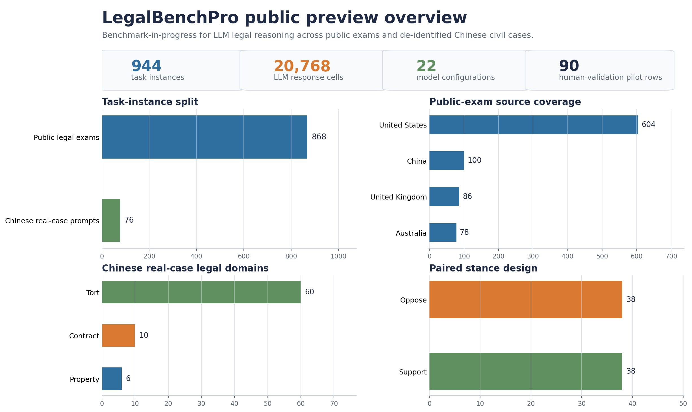

# LegalBenchPro

LegalBenchPro is a research benchmark for evaluating large language models on
open-ended legal reasoning, with a manuscript in preparation. The project asks whether
models that perform well on scalable public legal-exam tasks also transfer to
de-identified, practice-oriented case analysis.

The benchmark separates two evaluation settings:

- public legal-exam tasks with reference answers;
- de-identified Chinese civil judgment prompts that require stance-aware,
  statute-grounded legal analysis.

**Status (as of April 2026):** manuscript draft in preparation; 20,768 LLM response
cells collected across 22 model configurations; human-validation pilot underway; full
data release pending licensing, privacy, and source-distribution review.

**Draft introduction:** [paper/LegalBenchPro_intro_draft.pdf](paper/LegalBenchPro_intro_draft.pdf)

## Public Preview Overview



The figure is generated from committed public metadata:
`data/metadata/dataset_summary.json` and `data/metadata/source_distribution.csv`.

## At a Glance

- **Scope:** Chinese institutional and legal text, with both scalable
  public-exam prompts and de-identified civil-judgment reasoning tasks.
- **Evaluation design:** comparable task construction, model-configuration metadata,
  scoring regimes, and staged human-validation plans.
- **Reproducibility:** Python sample extraction, machine-readable metadata, tests,
  data-card documentation, and an explicit workflow audit trail.
- **Research workflow:** public artifacts are organized so that readers can inspect the
  path from workbook-derived metadata to samples, documentation, figures, and
  manuscript materials.

## Snapshot Counts

| Component | Current count | Evaluation design |
| --- | ---: | --- |
| Chinese real-case split | 76 issue-stance prompts | Citation-aware rubric with human validation in progress |
| Source judgments | 15 de-identified civil judgments | Paired support/opposition issue prompts |
| Public-exam split | 868 instances | Reference-answer consistency scoring |
| Model configurations | 22 | Standard, reasoning-enabled, and step-by-step prompting modes |
| Main multimodel response cells | 20,768 LLM-generated responses | 944 task instances x 22 model configurations |
| Human validation pilots | 10 real-case rows; 80 public-exam rows | Staged for reviewer calibration and agreement analysis |

The public preview includes 10 translated preview rows from the Chinese real-case
split, 20 preview rows from the public-exam split, model-configuration metadata, and
compact source/domain distribution tables. Preview CSV cells are capped at 420
characters.

## Research Contribution

LegalBenchPro is designed around a gap in current legal LLM evaluation: public legal
benchmarks are scalable and convenient, but legal practice often requires working from
long facts, contested interpretations, jurisdiction-specific authorities, and
defensible argument structure. This project contributes:

- a two-part benchmark that separates public-exam evaluation from real-case legal
  analysis;
- a curated Chinese civil judgment split with paired issue-stance prompts;
- a multimodel evaluation matrix spanning 22 model configurations and 20,768
  LLM-generated response cells;
- a scoring protocol that distinguishes answer matching from citation-aware legal
  reasoning;
- a reproducible public workflow for sample extraction, metadata generation, figure
  rendering, and manuscript tracking.

For empirical social-science research, the project is also a small example of how
LLM-assisted analysis can be made auditable: institutional text is treated as data,
model outputs are treated as evidence to be validated rather than accepted, and scoring
decisions are documented through schemas, rubrics, provenance notes, and rerunnable
scripts.

## Where To Start

For a quick review of the project, start with:

- [paper/LegalBenchPro_intro_draft.pdf](paper/LegalBenchPro_intro_draft.pdf) for the
  current draft introduction;
- `docs/DATA_CARD.md` for scope, counts, intended uses, and release constraints;
- `docs/ANNOTATION_PROTOCOL.md` for human-validation and scoring design;
- `docs/SCORING_RUBRIC.md` for the compact scoring rubric;
- `docs/AI_WORKFLOW.md` for auditability and AI-assistance safeguards;
- `data/README.md` for a compact public data preview;
- `data/sample/legalbenchpro_cn_judgments_sample.csv` for real-case content excerpts;
- `data/sample/legalbenchpro_public_exam_sample.csv` for public-exam content excerpts;
- `data/metadata/source_distribution.csv` and `data/metadata/model_configurations.csv`
  for concise metadata;
- `scripts/extract_public_sample.py` and `scripts/render_benchmark_overview.py` for
  the reproducible export and figure-rendering workflow.

## Repository Map

```text
paper/
  LegalBenchPro_intro_draft.pdf       # Current draft introduction
  introduction_revised.tex            # Dataset-aligned introduction for Overleaf
  manuscript_working_draft.md         # Working paper skeleton for GitHub readers
docs/
  DATA_CARD.md                        # Dataset scope, fields, release status, risks
  ANNOTATION_PROTOCOL.md              # Human validation plan and scoring dimensions
  AI_WORKFLOW.md                      # AI-assisted research workflow and safeguards
  SCORING_RUBRIC.md                   # Compact scoring rubric
  MANUSCRIPT_STATUS.md                # What is complete and what remains
data/
  README.md
  sample/legalbenchpro_cn_judgments_sample.csv
  sample/legalbenchpro_public_exam_sample.csv
  metadata/dataset_summary.json
  metadata/model_configurations.csv
  metadata/source_distribution.csv
outputs/
  figures/benchmark_overview.png      # Public metadata overview figure
scripts/
  extract_public_sample.py            # Rebuilds the public sample and metadata
  render_benchmark_overview.py        # Rebuilds the README overview figure
src/legalbenchpro/
  workbook.py                         # Small workbook helpers used by scripts
tests/
  test_workbook.py                    # Lightweight smoke tests for public utilities
```

## Reproduce Public Artifacts

If you have access to the private workbook, the public sample and metadata can be
regenerated from the local source file.

macOS/Linux:

```bash
python -m venv .venv
source .venv/bin/activate
python -m pip install -r requirements.txt
export PYTHONPATH="$PWD/src"
python scripts/extract_public_sample.py \
  --workbook "/path/to/Data Set.xlsx" \
  --out-dir data \
  --cn-sample-size 10 \
  --bar-sample-size 20 \
  --max-cell-chars 420
python scripts/render_benchmark_overview.py
```

Windows PowerShell:

```powershell
python -m venv .venv
.\.venv\Scripts\Activate.ps1
python -m pip install -r requirements.txt
$env:PYTHONPATH = "$PWD\src"
python .\scripts\extract_public_sample.py `
  --workbook "C:\path\to\Data Set.xlsx" `
  --out-dir data `
  --cn-sample-size 10 `
  --bar-sample-size 20 `
  --max-cell-chars 420
python .\scripts\render_benchmark_overview.py
```

## Validation

The repository includes a small test suite:

macOS/Linux:

```bash
export PYTHONPATH="$PWD/src"
python -m unittest discover -s tests
python -m compileall scripts src
```

Windows PowerShell:

```powershell
$env:PYTHONPATH = "$PWD\src"
python -m unittest discover -s tests
python -m compileall scripts src
```

## Research Software Signals

This repository is intentionally organized as a research-engineering artifact, not only
as a dataset announcement. It demonstrates:

- Python scripts that regenerate public samples, metadata, and the README overview
  figure from structured inputs;
- explicit dataset documentation, release constraints, and annotation protocol files;
- lightweight tests for workbook parsing utilities;
- an audit trail for AI-assisted coding and research workflow decisions;
- manuscript-facing materials that separate current evidence from future validation.

## Release Status

This is a research preview, not a final benchmark release. The public content samples
are excerpted and do not include the full prompt matrix, full reference answers, full
model outputs, row-level full indexes, or human review sheets. The full dataset will
require final licensing, privacy, source-distribution, and validation review before
release.

## Author and Collaborators

Initiated and led by Hongyu Wang.

Regular project meetings and manuscript/benchmark feedback: Yilun Zhao, Yale NLP Lab
PhD student.

Additional project feedback and collaboration: Yixin Liu, Yale NLP Lab; Xuandong Zhao,
UC Berkeley.

## Disclaimer

This repository is for research on model evaluation. It is not legal advice, a legal
research product, or a substitute for jurisdiction-specific legal review.
